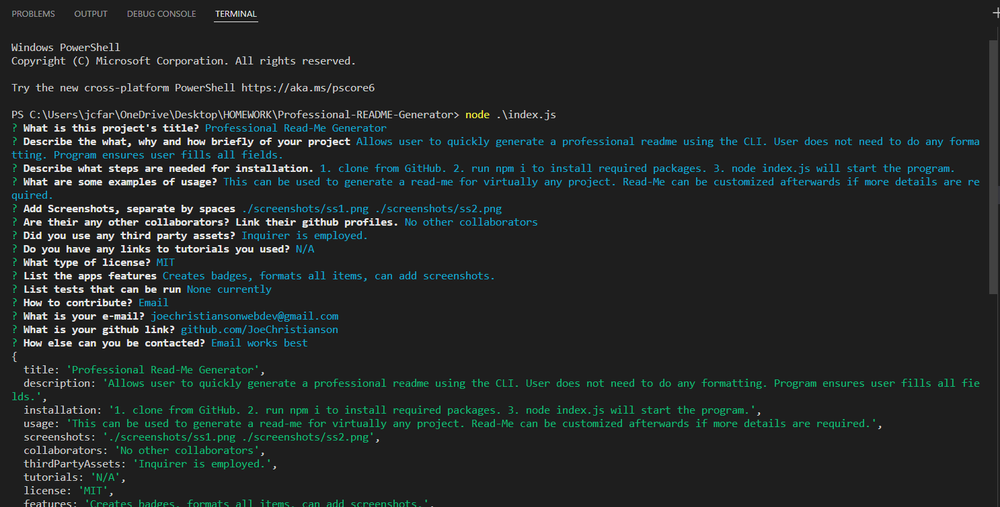
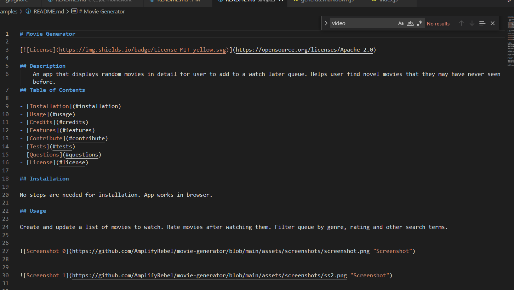

# Professional Read-Me Generator
  

  
## Description
    Allows user to quickly generate a professional readme using the CLI. User does not need to do any formatting. Program ensures user fills all fields.
## Table of Contents

- [Installation](#installation)
- [Usage](#usage)
- [Credits](#credits)
- [Features](#features)
- [Contribute](#contribute)
- [Tests](#tests)
- [Questions](#questions)
- [License](#license)

## Installation

1. clone from GitHub. 2. run npm i to install required packages. 3. node index.js will start the program.

## Usage

This can be used to generate a read-me for virtually any project. Read-Me can be customized afterwards if more details are required.

        

        

## Credits

Collaborators
- No other collaborators

Third Party Assets
- Inquirer is employed.

Tutorials
- N/A

## Features

- Creates badges, formats all items, can add screenshots.

## How to Contribute

Email
  
## Tests

None currently

## Questions

Any questions? Contact me at:
- E-mail: joechristiansonwebdev@gmail.com
- GitHub: github.com/JoeChristianson
- Other means: Email works best

## License

This app is covered by the MIT license. For more information, visit https://opensource.org/licenses/Apache-2.0.

